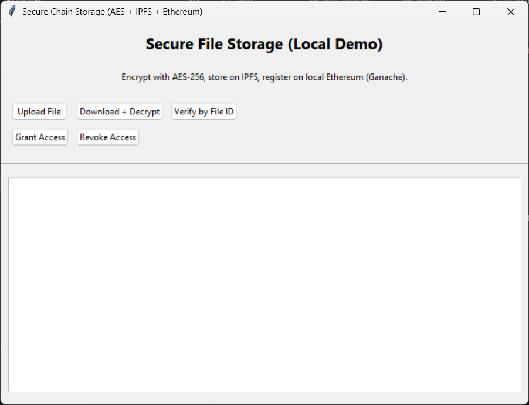



  <h1>Secure Chain Storage</h1>

  
<b>AES-256 + IPFS + Ethereum (Ganache)</b> 
  Encrypt locally • Store on IPFS • Prove & control access on-chain

  <!-- Badges -->
  

    
    
    
    
    
    
  

  <!-- Hero (we'll add a real screenshot next step) -->
  

---

## Table of Contents
- [What this is](#what-this-is)
- [How it works (one glance)](#how-it-works-one-glance)
- [Features](#features)
- [Setup (Windows)](#setup-windows)
- [Run the app](#run-the-app)
- [Usage](#usage)
- [Troubleshooting](#troubleshooting)
- [Security notes](#security-notes)
- [License](#license)

---

## What this is
A desktop app that:
- 🔐 Encrypts files locally with **AES-256-GCM**
- ☁️ Stores the encrypted bytes on **IPFS**
- 🧾 Records file metadata (owner, filename, CID, SHA-256) on **Ethereum** (local Ganache)
- 👤 Lets the owner **grant/revoke** access to on-chain metadata

## How it works (one glance)
File ──► AES-256-GCM (local) ──► Encrypted bytes
│
├──► IPFS upload ──► CID
│
└──► Ethereum (Ganache): { owner, filename, CID, sha256 }**fileId = sha256( CID + sha256(plaintext) )**

## Features
- Local-only (free to run)
- Upload → Encrypt → IPFS → On-chain record
- Download → Decrypt → Integrity verify
- Access control (owner can grant/revoke)

## Setup (Windows)
`powershell
# Python venv
python -m venv .venv
.\.venv\Scripts\Activate
pip install -r requirements.txt
pip install requests cryptography

# Local services
# - Start Ganache (GUI) at http://127.0.0.1:7545
# - First time IPFS:  ipfs init
# - Run IPFS daemon: ipfs daemon

# Environment (copy the template)
copy .env.example .env
# Fill PRIVATE_KEY and ACCOUNT_ADDRESS from a funded Ganache account
# Deploy contract (run again if you reset Ganache)
python deploy_contract.py

# Launch GUI
python app.py

Usage

Upload File → Encrypts locally → uploads to IPFS → writes metadata on-chain → shows CID + fileId + sha256

Verify by File ID → Shows on-chain metadata (owner, filename, CID, sha256)

Download + Decrypt → Fetches from IPFS → asks your password → decrypts → verifies integrity

Troubleshooting

“Access denied” → Use the owner account (from .env) or grant access.

“Nonce/replacement underpriced” → Restart Ganache once, then redeploy.

“Out of gas/invalid opcode” → Don’t re-use the same fileId (duplicates revert).

“IPFS error” → Ensure ipfs daemon is running and .env has IPFS_API=http://127.0.0.1:5001.

“cryptography not found” → pip install cryptography.

Security notes

Never commit your real .env (this repo uses .gitignore and has .env.example).

Ganache keys are for local testing only.

License

MIT — free to use and adapt.
